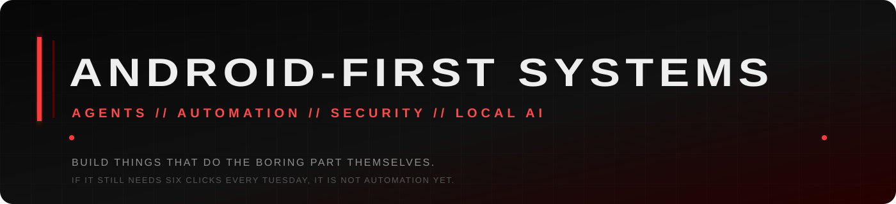

<div align="center">



<br>


<br>


</div>

---

## `// NO BIO. JUST SYSTEMS.`

Android-first AI systems, local agents, automation, scraping/data pipelines, security tooling and software built to remove repetitive human clicking from the loop.

A model gets interesting when it can **inspect state, call tools, change something, verify the result and continue**.

If it can only type an answer, congratulations: expensive autocomplete wearing a blazer.

```text
ANDROID
   |
   v
AGENT -> TOOLS -> INFRASTRUCTURE -> RESULT
  ^                                  |
  +----------- VERIFY ---------------+
```

**Local-first when useful. Cloud when it earns the invoice. Android is not a companion screen. It is the control plane.**

---

## `// THINGS THAT ACTUALLY EXIST`

<table>
<tr>
<td width="50%" valign="top">

### [PocketPort](https://github.com/levomm/pocketport)
**Run more GitHub tools on Android.**

Scans desktop-first repositories, chooses a Termux/native/PRoot execution path, applies conservative fixes and prepares a runnable Android workspace.

`Android` `Termux` `Python` `repo analysis`

</td>
<td width="50%" valign="top">

### [CLAW Bridge](https://github.com/levomm/claw-bridge)
**Your phone is the control plane.**

Android-first AI-agent harness for chat, code, automation, private Linux runtimes, SSH/remote machines and approval-driven execution.

`Android` `agents` `remote control` `automation`

</td>
</tr>
<tr>
<td width="50%" valign="top">

### [SeekerClaw](https://github.com/levomm/SeekerClaw)
**An AI agent that lives on the device.**

Android agent runtime with tool use, Telegram/Discord control, multi-provider models, MCP tools and autonomous workflows.

`Kotlin` `Compose` `Node.js` `MCP`

</td>
<td width="50%" valign="top">

### [osx01](https://github.com/levomm/osx01)
**Small local coding agent. No cloud ceremony required.**

Reads, searches, edits and executes inside real projects through Ollama and OpenAI-compatible tool calling.

`Python` `Ollama` `tool calling` `local AI`

</td>
</tr>
<tr>
<td width="50%" valign="top">

### [DNB CHOPSHOP](https://github.com/levomm/DNB_CHOPSHOP)
**Browser-based drum & bass workstation.**

Transient analysis, slicing, variation generation, sequencing and stem/MIDI export in one browser workflow.

`React` `TypeScript` `Web Audio` `Tone.js`

</td>
<td width="50%" valign="top">

### [RAW TAG](https://github.com/levomm/raw-tag)
**Draw first. Let the machine interfere afterwards.**

Finger/stylus graffiti sketch lab that develops a real drawing through AI-assisted street-art transformations.

`React` `TypeScript` `Gemini` `Cloudflare`

</td>
</tr>
</table>

---

## `// PARTS BIN`

<div align="center">


<br><br>


</div>

---

## `// OPERATING MODE`

```yaml
platform: Android + Termux + Linux

focus:
  - agents with real tool use
  - mobile-first developer tooling
  - business automation
  - scraping and data pipelines
  - security testing and observability
  - local / self-hosted AI

rules:
  - verify the result
  - dangerous actions need approval gates
  - repeated work should become code
  - "AI-powered" is not a feature by itself
  - ship working systems before writing architecture poetry
```

---

## `// TELEMETRY, BECAUSE APPARENTLY WE NEED GRAPHS`

<div align="center">


<br>


</div>

---

<div align="center">

### `BUILD > BREAK > VERIFY > SHIP`

<sub>No 97% Python skill bar. No inspirational quote. The repositories are right there.</sub>

<br><br>

<a href="https://github.com/levomm?tab=repositories">
  
</a>

</div>
